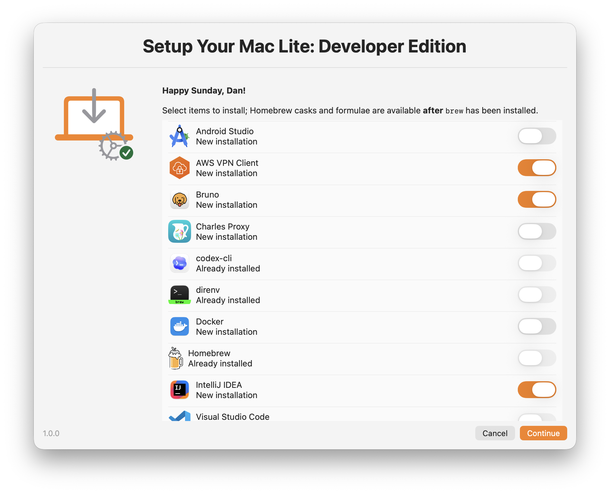
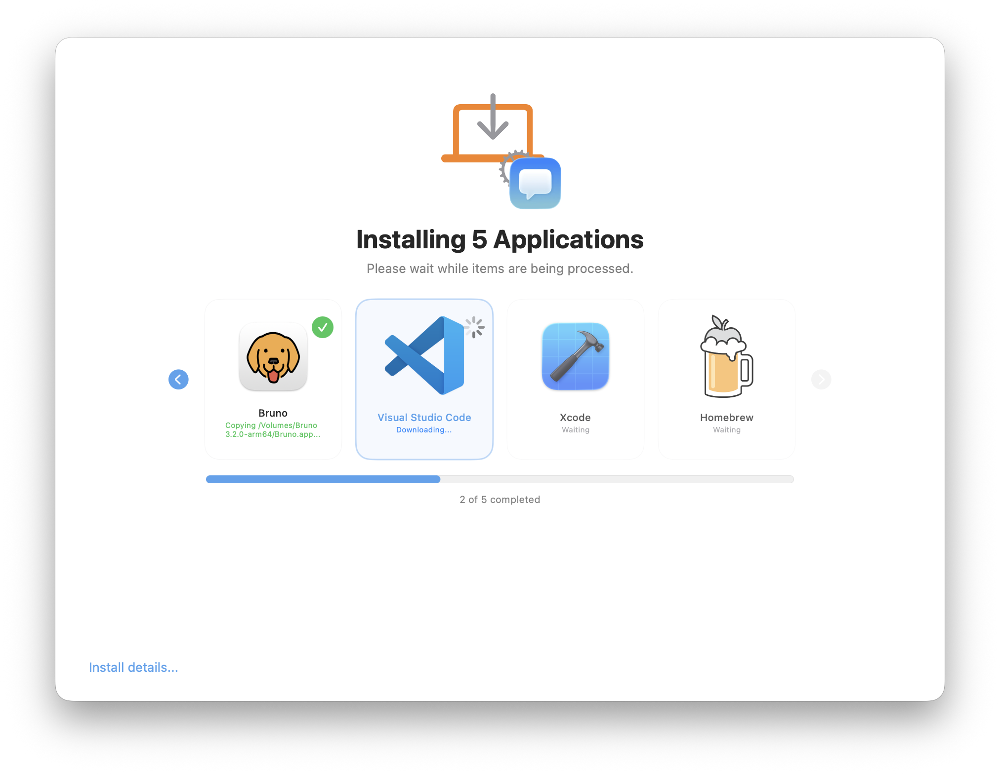
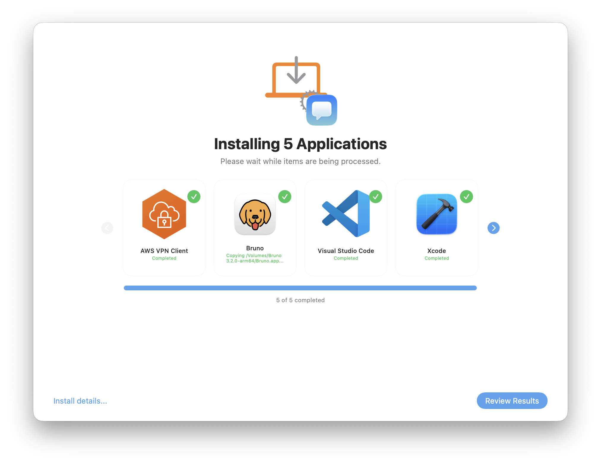
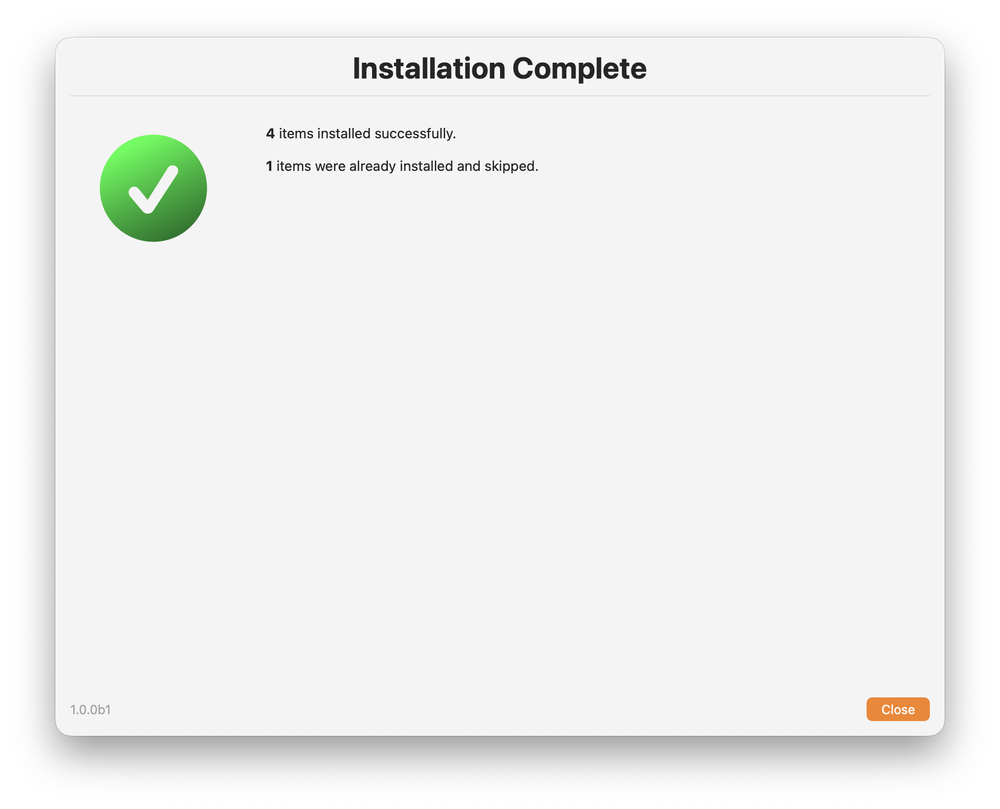
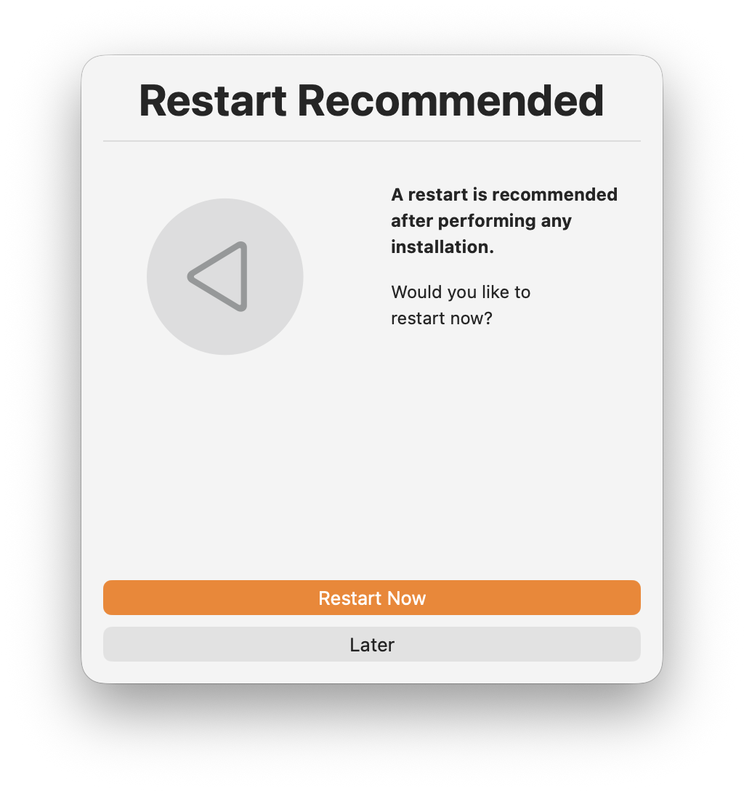
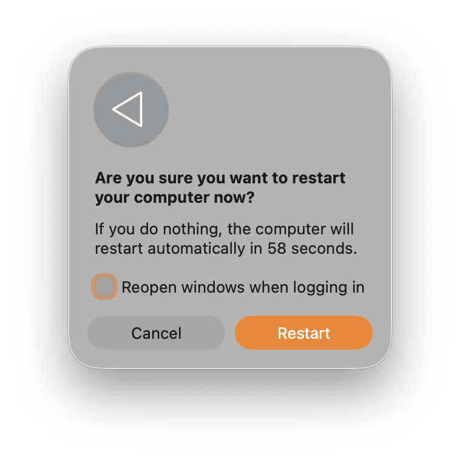

    

# SYM-Lite (1.0.0b7)

> **SYM-Lite** is a lean, purpose-built script for executing MDM-agnostic [Installomator labels](https://github.com/Installomator/Installomator/tree/main/fragments/labels), Jamf Pro-specific [policy triggers](https://learn.jamf.com/r/en-US/jamf-pro-documentation-current/Triggers_for_Policies), and approved Homebrew casks/formulas through a unified [swiftDialog](https://swiftdialog.app) selection interface

## Screenshots

<table>
  <tr>
    <td align="center">
      
    </td>
    <td align="center">
      
    </td>
    <td align="center">
      
    </td>
  </tr>
  <tr>
    <td align="center">
      
    </td>
    <td align="center">
      
    </td>
    <td align="center">
      
    </td>
  </tr>
</table>


---

## Key Features

✓ **Unified execution support** — Installomator labels, Jamf Pro policies, and approved Homebrew packages in a single session  
✓ **Interactive selection UI** — User-friendly checkbox dialog with per-item icons; optional install-state labels disable already-installed items and exit cleanly when nothing remains selectable  
✓ **Alphabetical sorting** — All items sorted together by display name in selection dialog  
✓ **Silent mode** — CSV-based automation support  
✓ **Early Installomator label validation** — Configured Installomator labels are verified against the active Installomator file before they can appear or run  
✓ **Homebrew package support** — Approved casks and formulas run in the logged-in user context when `brew` is available  
✓ **Inspect Mode monitoring** — Rich status updates for Installomator labels and path-based progress for Jamf/Homebrew items  
✓ **Log monitoring** — Parses Installomator.log for intermediate states and captures Homebrew/Jamf output into the main log  
✓ **Path-based validation** — Pre/post-execution checks via file system monitoring  
✓ **Cache monitoring** — Detects in-progress downloads  
✓ **Completion report** — Per-item results summary and optional restart prompt  
✓ **Graceful interruption** — Clean shutdown on SIGINT/SIGTERM with 30-second timeout  

---

## Quick Start Guide

### Adding Installomator Labels

Edit the `installomatorLabels` array near the top of `SYM-Lite.zsh`:

```zsh
installomatorLabels=(
    "label | Display Name | Validation Path | Icon URL"
)
```

**Example:**
```zsh
installomatorLabels=(
    "microsoftword | Microsoft Word | /Applications/Microsoft Word.app | https://icon.url"
    "googlechrome | Google Chrome | /Applications/Google Chrome.app | https://icon.url"
    "zoom | Zoom | /Applications/zoom.us.app | https://icon.url"
)
```

At runtime, SYM-Lite validates each configured label against `organizationInstallomatorFile` before building the picker or accepting silent-mode CSV input. If a label is missing from that Installomator file, SYM-Lite logs an error and removes it from the current run.

### Adding Jamf Policy Items

Edit the `jamfPolicyItems` array near the top of `SYM-Lite.zsh`:

```zsh
jamfPolicyItems=(
    "trigger | Display Name | Validation Path | Icon URL"
)
```

**Example:**
```zsh
jamfPolicyItems=(
    "installRosetta | Install Rosetta 2 | /usr/bin/arch | SF=cpu"
    "enableFileVault | Enable FileVault | /Library/Preferences/com.apple.fdesetup.plist | SF=lock.shield"
    "configureDock | Configure Dock | /usr/local/bin/dockutil | SF=dock.rectangle"
)
```

**Icon Options:**
- Full URL: `https://...`
- SF Symbol: `SF=symbolname,weight=semibold,colour1=auto,colour2=auto`

### Adding Homebrew Items

Edit the `homebrewItems` array near the top of `SYM-Lite.zsh`:

```zsh
homebrewItems=(
    "cask:token | Display Name | Validation Path | Icon URL"
    "formula:token | Display Name | Validation Path | Icon URL"
)
```

**Example:**
```zsh
homebrewItems=(
    "cask:docker | Docker Desktop | /Applications/Docker.app | https://icon.url"
    "formula:node | Node.js | /opt/homebrew/bin/node | SF=terminal"
    "formula:python@3.12 | Python 3.12 | /opt/homebrew/bin/python3.12 | SF=terminal"
)
```

**Important:**
- Use `cask:` or `formula:` prefixes in the item ID
- Homebrew examples and default validation paths in this repo assume Apple silicon with Homebrew installed in `/opt/homebrew`
- Homebrew items are hidden for the current run if no working `brew` binary is available
- Homebrew items also require a valid logged-in user because package installs run in user context rather than as `root`

### Disabling Jamf Policy Items

If your environment does not use Jamf Pro, set `enableJamfPolicyItems="false"` near the top of `SYM-Lite.zsh`.

When Jamf policy items are disabled:
- Jamf policy items do not appear in the interactive selection UI
- Jamf policy items do not execute
- Jamf binary pre-flight validation is skipped
- Silent mode warns and skips Jamf item IDs in the CSV input

### Disabling Homebrew Items

If your environment does not use Homebrew packages through SYM-Lite, set `enableHomebrewItems="false"` near the top of `SYM-Lite.zsh`.

When Homebrew items are disabled:
- Homebrew items do not appear in the interactive selection UI
- Homebrew items do not execute
- Homebrew pre-flight detection is skipped
- Silent mode warns and skips Homebrew item IDs in the CSV input

---

## Usage

### Interactive Mode (Default)

Run the script as root with no parameters:

```bash
sudo ~/Downloads/SYM-Lite.zsh
```

**User experience:**
1. Selection dialog appears with all configured items
2. User selects one or more items using checkboxes
3. Inspect Mode dialog launches showing real-time progress
4. Completion report shows one row per selected item
5. Optional restart prompt

If the user clicks `Cancel` in the selection dialog, interactive mode exits cleanly without launching Inspect Mode. If `selectionDialogStatusSublabelsEnabled="true"` and every remaining valid item is already installed, interactive mode shows an informational dialog and exits without launching Inspect Mode. If no valid items remain after configuration validation, interactive mode exits cleanly with a generic unavailable-items message.

**Interactive mode requirements:**
- Requires an active logged-in GUI user
- Waits up to 120 seconds for a valid console user before exiting
- If the Mac is at the login window or otherwise headless, use `silent` mode instead

### Silent Mode

Run with Jamf parameters or direct positional arguments:

**Via Jamf Policy:**
- Parameter 4: `silent`
- Parameter 5: `microsoftword,cask:docker,formula:node,installRosetta`

**Direct execution:**
```bash
sudo /path/to/SYM-Lite.zsh "" "" "" silent "microsoftword,cask:docker,formula:node"
```

**Silent mode behavior:**
- No selection dialog
- CSV list parsed directly
- No Inspect Mode or completion dialogs
- No restart prompt
- Same pre-flight checks still run, including `swiftDialog` validation / installation
- Installomator labels filtered out during pre-flight validation are warned and skipped in the CSV input
- If Jamf policy items are disabled, Jamf item IDs in the CSV are warned and skipped
- If Homebrew items are disabled or unavailable for the current run, Homebrew item IDs in the CSV are warned and skipped
- Exits with an error if the CSV contains no valid item IDs
- Suitable for automated deployment

---

## Dependencies

### Required
- **macOS** 15+ (required by swiftDialog 3.x)
- **Root access** — Script must run as `root`
- **swiftDialog** 3.0.1.4955+ (auto-installed if missing)

### External Command Dependencies
- **Installomator** — Required for selected Installomator labels to succeed
- Configured Installomator labels are validated early against the active `organizationInstallomatorFile`
  - Default path: `/Library/Management/AppAutoPatch/Installomator/Installomator.sh` [:link:](https://github.com/App-Auto-Patch/App-Auto-Patch/wiki)
    - Edit `organizationInstallomatorFile` variable to customize
  - If the configured file is missing, not a regular file, unreadable, non-executable, or zero bytes, pre-flight exits with a fatal error
  - If SYM-Lite cannot parse the Installomator label case statement from that file, pre-flight exits with a fatal error
  - If a configured label does not exist in that Installomator file, SYM-Lite logs an error and removes it from the current run
- **Jamf Pro Binary** — Required only when `enableJamfPolicyItems="true"` and Jamf policy items are configured
  - Default path: `/usr/local/bin/jamf`
  - If the binary is missing, pre-flight logs warnings and selected Jamf policy items will fail at execution time
- **Homebrew Binary** — Required only when `enableHomebrewItems="true"` and Homebrew items are configured
  - Default detection order: `/opt/homebrew/bin/brew`, then `/usr/local/bin/brew`
  - Set `brewPath` to override detection with an organization-specific path
  - Homebrew examples and default validation paths in this repo assume Apple silicon with Homebrew installed in `/opt/homebrew`
  - If no working `brew` binary is found, SYM-Lite hides Homebrew items from the current run and warns in the log
  - Homebrew items require a valid logged-in user because package installs run in user context rather than as `root`

---

## Execution Flow

```
PRE-FLIGHT CHECKS
  ├─ Verify root
  ├─ Check/install swiftDialog
  ├─ Normalize Jamf item availability from configuration
  ├─ Normalize Homebrew item availability and detect brew path
  ├─ Validate Installomator file and normalize Installomator labels
  └─ Verify Jamf binary (if enabled and items configured)
       ↓
SELECTION INTERFACE
  ├─ Show dialog (interactive) or parse CSV (silent)
  ├─ Validate at least one selection
  └─ Separate items by type
       ↓
INSPECT MODE CONFIGURATION
  ├─ Interactive mode only
  ├─ Build unified JSON config
  ├─ Merge Installomator + Jamf + Homebrew items
  ├─ Add cachePaths for download detection
  └─ Validate JSON with plutil
       ↓
EXECUTION ENGINE
  ├─ Interactive mode launches Inspect Mode dialog (background)
  │   └─ Silent mode logs progress without UI
  ├─ Process items sequentially
  │   ├─ Installomator: executeInstallomatorLabel()
  │   ├─ Jamf: executeJamfPolicy()
  │   └─ Homebrew: executeHomebrewItem()
  ├─ Interactive mode waits for Inspect Mode to close
  └─ Silent mode exits when execution completes
       ↓
COMPLETION & RESTART
  ├─ Interactive mode shows a completion report for selected items
  └─ Interactive mode prompts for restart (if enabled and something was newly installed)
```

---

## How Inspect Mode Works

swiftDialog's [Inspect Mode](https://swiftdialog.app/advanced/inspect-mode/) uses **dual monitoring** for comprehensive progress tracking:

### For Installomator Labels (Rich Status)

**Log Monitoring:**
- Parses `/var/log/Installomator.log` in real-time
- Uses undocumented `"preset": "installomator"` feature
- Shows intermediate states:
  - "Downloading..." (with progress if available)
  - "Installing Microsoft Word..."
  - "Verifying..."
  - "Completed"

**File System Monitoring:**
- Watches validation path via FSEvents API
- Item marks complete when app appears at specified path
- Independent verification of installation success

### For Jamf Pro Policies (Binary Status)

**File System Monitoring Only:**
- No log parsing (no Jamf equivalent to Installomator preset)
- Shows binary states:
  - "Waiting" (policy executing)
  - "Completed" (validation path detected)

### For Homebrew Items (Binary Status)

**File System Monitoring Only:**
- No Inspect Mode log parsing (Homebrew items rely on validation paths)
- Shows binary states:
  - "Waiting" (package install executing)
  - "Completed" (validation path detected)

### Common Features

**All item types benefit from:**
- `cachePaths` monitoring — Detects `.pkg`, `.dmg`, `.download` files in progress
- `scanInterval: 2` — Checks for path changes every 2 seconds
- Auto-enable Close button when all items complete
- 30-second timeout if dialog doesn't close naturally

**Example Flow (Installomator):**
1. Script executes: `Installomator.sh microsoftword`
2. Log shows: "Downloading..." → User sees rich progress
3. Log shows: "Installing Microsoft Word..." → Status updates
4. Path appears: `/Applications/Microsoft Word.app` → Marks complete

**Example Flow (Jamf Policy):**
1. Script executes: `jamf policy -event installRosetta`
2. Dialog shows: "Waiting" → No intermediate updates
3. Path appears: `/usr/bin/arch` → Marks complete

**Example Flow (Homebrew Formula):**
1. Script executes Homebrew as the logged-in user: `brew install node`
2. Dialog shows: "Waiting" while the package installs
3. Path appears: `/opt/homebrew/bin/node` → Marks complete

---

## Restart Prompt Behavior

In interactive mode, after all items complete and the completion report closes, SYM-Lite prompts for a restart (if `restartPromptEnabled="true"` and something was newly installed).

**Restart Prompt Dialog:**
- Title: "Restart Recommended"
- Message: "A restart may be recommended after installing software or applying these changes. Would you like to restart now?"
- Button 1: "Restart Now"
- Button 2: "Later"

**User Clicks "Restart Now":**
1. Script sends AppleScript restart event to loginwindow
2. macOS shows its **standard restart confirmation dialog**
3. User confirms the restart (or cancels at macOS level)
4. This is a "polite" restart — gives user final control

**User Clicks "Later":**
1. Script logs "User chose to restart later"
2. Script exits normally
3. No restart occurs

**Silent Mode:**
- Restart prompt **never shows** in silent mode
- Script exits when item execution completes
- Suitable for unattended deployment

**All Items Already Installed:**
- Interactive mode still shows the completion report
- Restart prompt does not show

**Disable Restart Prompt:**
Set `restartPromptEnabled="false"` in the script to skip the prompt entirely in all modes.

**Technical Implementation:**
- Uses `executeRestartAction "Restart Confirm"` helper
- Sends `«event aevtrrst»` to loginwindow as logged-in user
- Runs via `runAsUser` to ensure proper user context
- Falls back gracefully if AppleScript command fails

---

## Validation & Skip Logic

### Installomator Items
1. **Pre-check:** If validation path exists → skip, log "already exists"
2. **Execute:** Run Installomator with `DEBUG=0 NOTIFY=silent`
3. **Inspect Mode:** Watches validation path, marks complete when app appears
4. **Post-check:** Exit code 0 = success, non-zero = failure

### Jamf Policy Items
1. **Pre-check:** If validation path exists → skip, log "already configured"
2. **Execute:** Run `jamf policy -event <trigger>`
3. **Inspect Mode:** Watches validation path, marks complete when file appears
4. **Post-check:** 
   - Exit code 0 + validation path exists = success
   - Exit code 0 + validation path missing = success (warn)
   - Non-zero exit code = failure

### Homebrew Items
1. **Pre-check:** If validation path exists → skip, log "already exists"
2. **Execute:** Run Homebrew as the logged-in user with `brew install` or `brew install --cask`
3. **Inspect Mode:** Watches validation path, marks complete when the path appears
4. **Post-check:**
   - Exit code 0 + validation path exists = success
   - Exit code 0 + validation path missing = success (needs review)
   - Non-zero exit code = failure

**Important:** Inspect Mode visual feedback is independent of script success/failure tracking. The dialog shows items as complete when paths appear, but the script tracks actual execution success separately.

---

## Customization Variables

| Variable | Default | Purpose |
|----------|---------|---------|
| `organizationPreset` | `"2"` | swiftDialog Inspect Mode preset (1-4) |
| `organizationInstallomatorFile` | `/Library/Management/...` | Path to Installomator.sh |
| `installomatorLog` | `/var/log/Installomator.log` | Installomator log path for monitoring |
| `jamfBinary` | `/usr/local/bin/jamf` | Path to jamf binary |
| `enableJamfPolicyItems` | `"true"` | Show and execute Jamf policy items |
| `brewPath` | `""` | Optional Homebrew binary override |
| `enableHomebrewItems` | `"true"` | Show and execute Homebrew cask/formula items |
| `homebrewUpdateBeforeInstall` | `"false"` | Run `brew update` once before the first Homebrew package install |
| `organizationOverlayiconURL` | swiftDialog logo | Overlay icon URL |
| `mainDialogIcon` | GitHub raw `SYM_icon.png` URL | Main dialog icon |
| `fontSize` | `"14"` | Dialog message font size |
| `selectionDialogStatusSublabelsEnabled` | `"true"` | Show install-state sublabels, disable already-installed items in the interactive picker, and exit cleanly if no selectable items remain |
| `restartPromptEnabled` | `"true"` | Show restart prompt after completion |
| `scriptLog` | `/var/log/...log` | Client-side log path |

---

## Logging

**Primary Log:** `/var/log/org.churchofjesuschrist.log`
- Set `scriptLog` to your organization's preferred log path

**Log Levels:**
- `[PRE-FLIGHT]` — Initial checks
- `[NOTICE]` — Major operations
- `[INFO]` — Detailed status updates
- `[WARNING]` — Non-fatal issues
- `[ERROR]` — Failures
- `[FATAL ERROR]` — Script termination

**Output Capture:**
- Installomator output: Captured and logged with `Installomator (label):` prefix
- Jamf policy output: Captured and logged with `Jamf (trigger):` prefix
- Homebrew output: Captured and logged with `Homebrew (itemID):` prefix
- All output written to primary script log for troubleshooting

**Inspect Mode Monitoring:**
- **Installomator labels:** Log parsing (`/var/log/Installomator.log`) + file system monitoring
- **Jamf policies:** File system monitoring only (FSEvents)
- **Homebrew items:** File system monitoring only (FSEvents)
- Items mark complete when validation paths appear
- Rich status updates shown for Installomator labels during execution

**Auto-rotation:** Log rotates when exceeds 10MB

---

## Troubleshooting

### swiftDialog not installing
- Check internet connectivity
- Verify GitHub access (not blocked by firewall)
- Manually download from: https://github.com/swiftDialog/swiftDialog/releases

### Items being skipped
- Check validation paths are correct
- Verify apps/files don't already exist
- Review pre-flight log messages

### Jamf policies failing
- Verify jamf binary exists: `ls -l /usr/local/bin/jamf`
- Test trigger manually: `sudo jamf policy -event <trigger>`
- Check policy exists in Jamf Pro and trigger name matches

### Installomator failures
- Verify Installomator path: `ls -lah /Library/Management/.../Installomator.sh`
- Verify file is non-zero bytes — a zero-byte Installomator file causes a fatal pre-flight error
- Test label manually: `sudo /path/to/Installomator.sh <label> DEBUG=1`
- Check label exists and is spelled correctly

### Homebrew failures
- Verify brew path: `ls -l /opt/homebrew/bin/brew /usr/local/bin/brew`
- If you set `brewPath`, confirm the override is executable
- Verify a real user is logged in at the macOS desktop; Homebrew items run in user context
- Test manually as the logged-in user: `brew install <formula>` or `brew install --cask <cask>`
- Review validation paths carefully; Homebrew success still depends on the configured path appearing

### Missing dependencies
- If `swiftDialog` is unavailable and cannot be installed, the script exits during pre-flight
- If `Installomator.sh` is missing, pre-flight logs warnings but selected Installomator labels fail when executed
- If the `jamf` binary is missing, pre-flight logs warnings but selected Jamf policy items fail when executed
- If the `brew` binary is missing or no logged-in user is available, configured Homebrew items are hidden for the current run
- If `enableJamfPolicyItems="false"`, Jamf policy items are hidden and the `jamf` binary is not required
- If `enableHomebrewItems="false"`, Homebrew items are hidden and `brew` is not required

### Interactive mode exits before showing dialogs
- Verify a real user is logged in at the macOS desktop
- Interactive mode waits up to 120 seconds for a valid console user, then exits
- If the Mac is at the login window or running headless, use `silent` mode instead

### Selection dialog empty
- Verify items are configured in arrays
- Check array syntax (space-padded pipe-separated fields: `"id | Display Name | /validation/path | iconURL"`)
- Review pre-flight log for parsing errors
- Homebrew items are hidden automatically if `brew` is unavailable or no logged-in user can run them

### Script hangs after clicking Close
- Script implements 30-second timeout for dialog close
- After timeout, dialog is force-terminated and script continues
- Check for debug output in terminal (may indicate dialog issue)
- Verify `dialogPID` was captured correctly in logs
- If consistently hanging, check for swiftDialog version issues

---

## Testing Checklist

### Before Production
- [ ] Edit `installomatorLabels` array with organization's apps
- [ ] Edit `jamfPolicyItems` array with organization's policies, or disable Jamf policy items if unused
- [ ] Edit `homebrewItems` array with approved casks and formulas, or disable Homebrew items if unused
- [ ] Update icon URLs to organization's icons
- [ ] Verify Installomator path matches environment
- [ ] Verify Jamf binary path matches environment if Jamf policy items are enabled
- [ ] Verify Homebrew path detection or `brewPath` override if Homebrew items are enabled
- [ ] Test interactive mode with single item
- [ ] Test silent mode with CSV input
- [ ] Test mixed selection (Installomator + Jamf + Homebrew)
- [ ] Verify validation paths are correct
- [ ] Test failure handling (invalid label/trigger)
- [ ] Test skip logic (pre-installed items)
- [ ] Verify restart prompt behavior

### Functional Tests
1. **Interactive single item:** Select one Installomator label → verify install
2. **Interactive multiple:** Select 2+ items → verify sequential execution
3. **Silent mode:** Run with CSV → verify no dialogs, auto-execute
4. **Mixed execution:** Select all configured item types → verify each executes correctly
5. **Skip logic:** Select already-installed item → verify skip
6. **Homebrew formula:** Select one formula item → verify user-context install and validation
7. **Failure handling:** Select invalid item → verify error capture
8. **Completion dialog:** Verify success/failure counts accurate
9. **Restart prompt:** Test both "Restart Now" and "Later" buttons

---

## Next Steps

1. **Configure items** — Edit arrays with your organization's apps, policies, and approved Homebrew packages
2. **Update paths** — Verify Installomator, Jamf, and Homebrew paths match your environment
3. **Icon URLs** — Replace example URLs with your organization's icon URLs
4. **Test in VM** — Run through test checklist in non-production environment
5. **Deploy to Self Service** — Add as Jamf Self Service policy with appropriate scope
6. **Monitor logs** — Review `/var/log/org.churchofjesuschrist.log` for operational insights

---

## Support

> Community-supplied, best-effort support is available on the [Mac Admins Slack](https://www.macadmins.org/) (free, registration required) [#setup-your-mac](https://slack.com/app_redirect?channel=C04FRRN3281) channel, or you can open an [issue](https://github.com/setup-your-mac/SYM-Lite/issues).

### Troubleshooting:
- Review script logs: `/var/log/org.churchofjesuschrist.log`
- Check syntax: `zsh -n /path/to/SYM-Lite.zsh`
- Validate swiftDialog: `/usr/local/bin/dialog --version`
- Test Installomator: `sudo /path/to/Installomator.sh <label> DEBUG=1`
- Test Jamf trigger: `sudo jamf policy -event <trigger> -verbose`
- Test Homebrew item as the logged-in user: `brew install <formula>` or `brew install --cask <cask>`

---

**Version:** 1.0.0b6  
**Date:** 08-Apr-2026  
**Author:** Dan K. Snelson (@dan-snelson)
