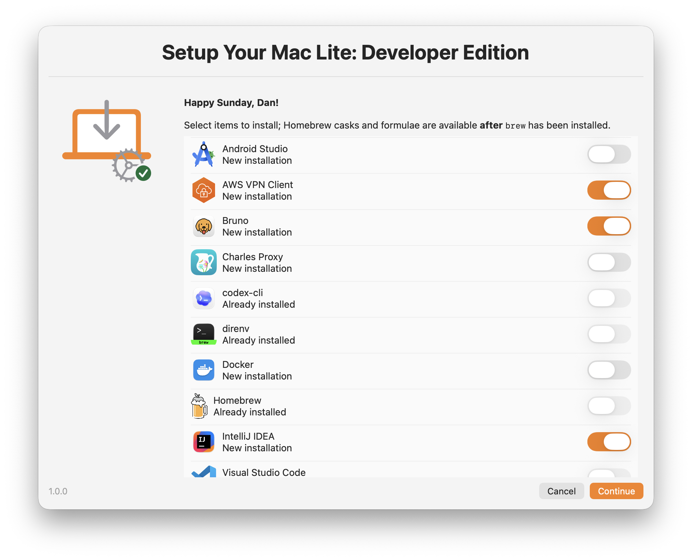
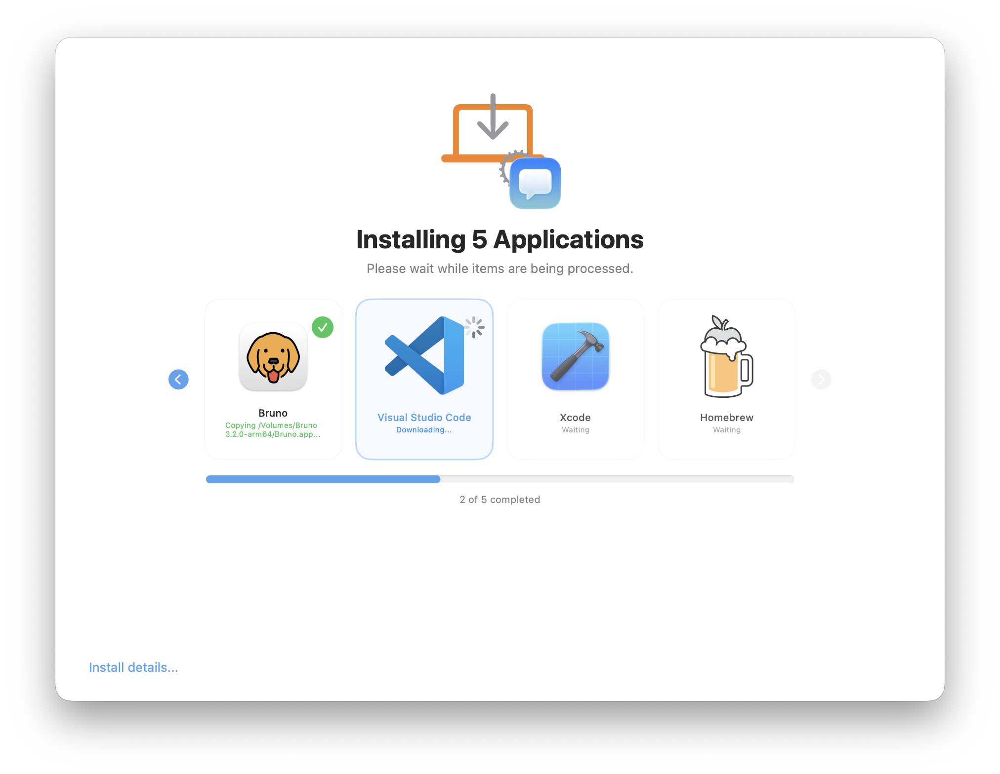
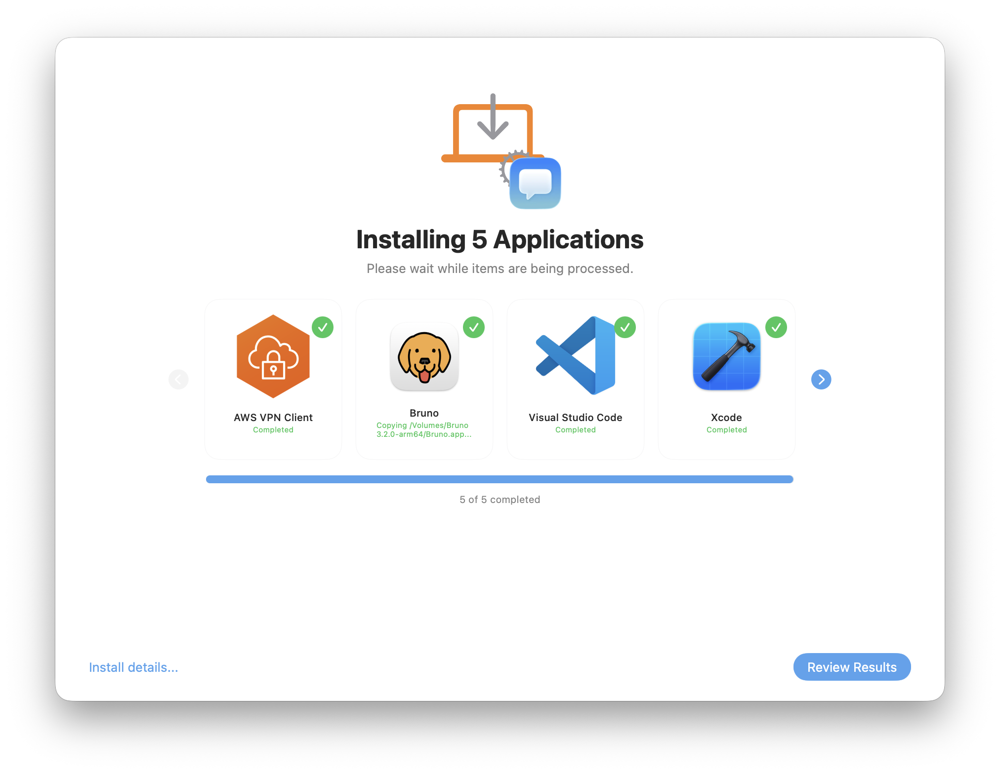
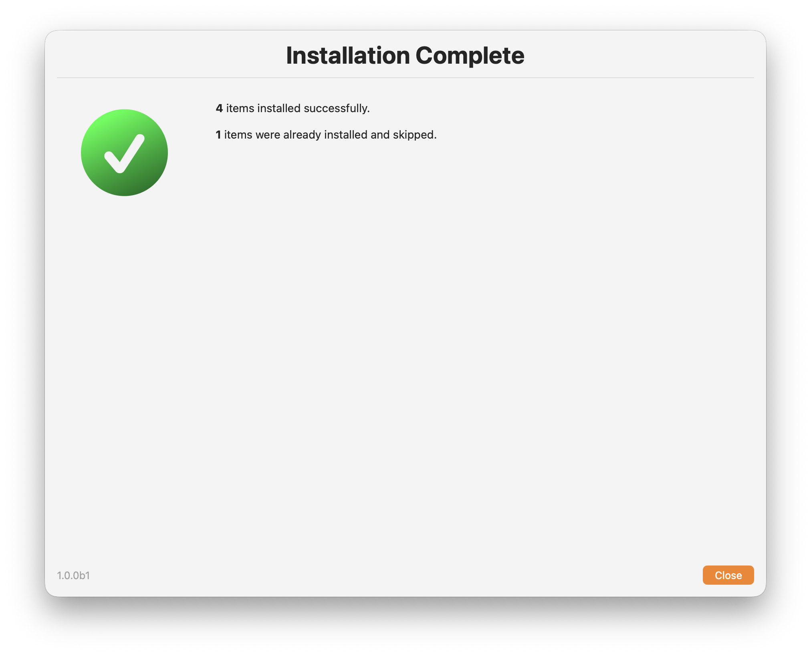
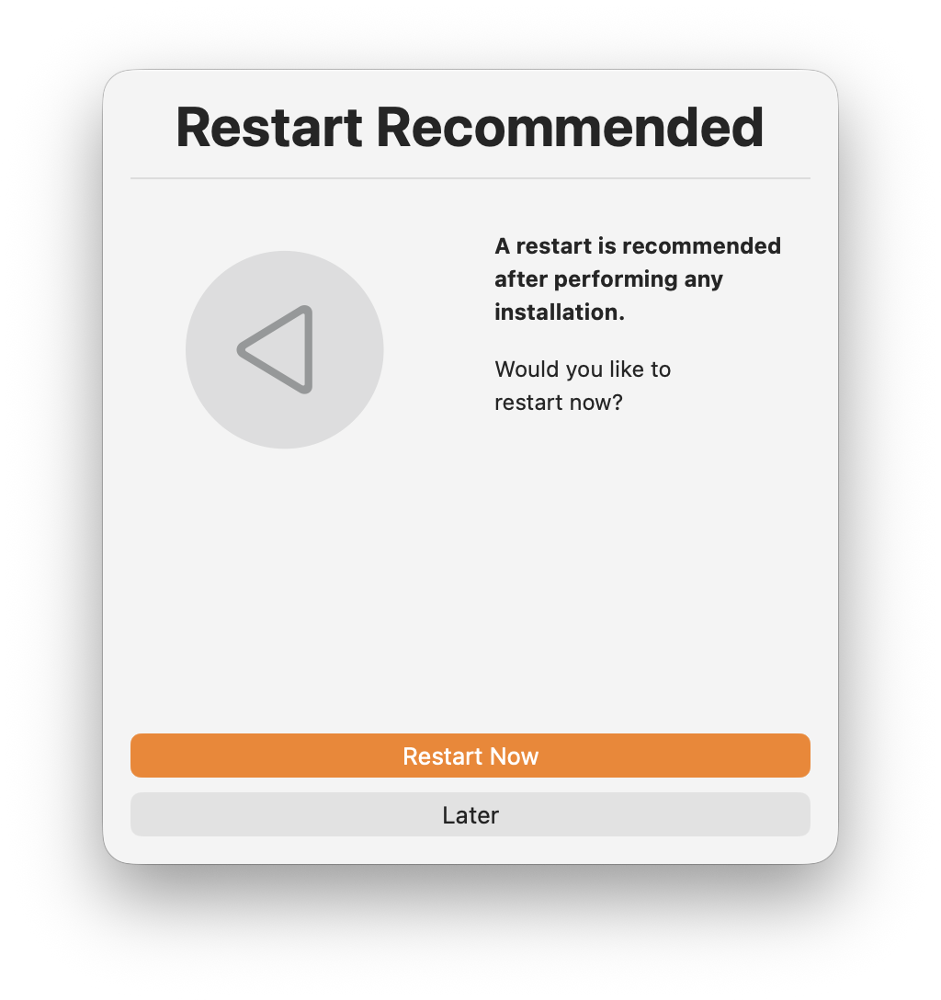
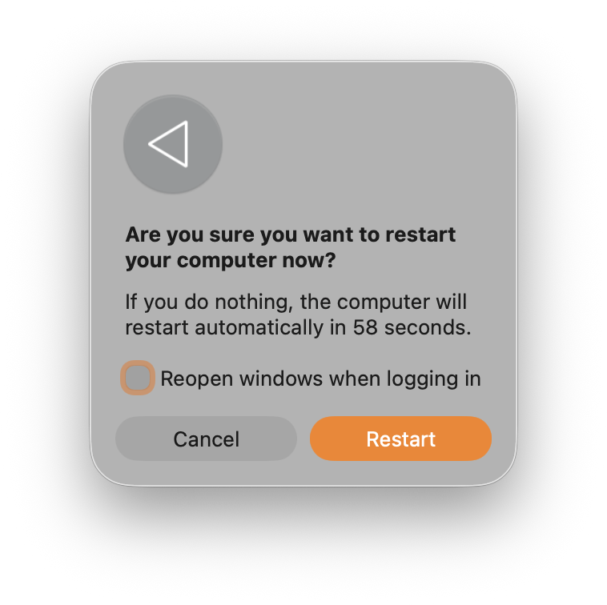

     [](https://swiftdialog.app) [](https://semgrep.dev)

# SYM-Lite (1.2.0)

> **SYM-Lite** is a single macOS script for executing approved [Installomator labels](https://github.com/Installomator/Installomator/tree/main/fragments/labels), [Homebrew](https://brew.sh) casks / formulas, Jamf Pro [policy triggers](https://learn.jamf.com/r/en-US/jamf-pro-documentation-current/Triggers_for_Policies), and [Fleet self-service software installs](https://fleetdm.com/docs/rest-api/rest-api#install-self-service-software-by-fleet-desktop-token), all through a unified [swiftDialog](https://swiftdialog.app) selection and reporting interface.

## Screenshots

<table>
  <tr>
    <td align="center">
      
    </td>
    <td align="center">
      
    </td>
    <td align="center">
      
    </td>
  </tr>
  <tr>
    <td align="center">
      
    </td>
    <td align="center">
      
    </td>
    <td align="center">
      
    </td>
  </tr>
</table>

---

## Key Features

✓ **Unified execution support** — Installomator labels, Homebrew packages, and optional Jamf Pro policies and Fleet software installs in a single session<br>
✓ **Interactive selection UI** — User-friendly checkbox dialog with per-item icons; optional install-state labels disable already-installed items and exit cleanly when nothing remains selectable  
✓ **Alphabetical sorting** — All items sorted together by display name in selection dialog  
✓ **Silent mode** — CSV-based automation support  
✓ **Early Installomator label validation** — Configured Installomator labels are verified against the active Installomator file before they can appear or run  
✓ **Homebrew package support** — Approved casks and formulas run in the logged-in user context when `brew` is available  
✓ **Fleet software support** — Approved self-service custom packages and script-only packages use the Mac's Fleet Desktop token, with completion checked through Fleet<br>
✓ **Inspect Mode monitoring** — Rich status updates for Installomator labels, path-based progress for Homebrew/Jamf items, and Fleet install outcome monitoring<br>
✓ **Log monitoring** — Parses Installomator.log for intermediate states and captures Homebrew/Jamf output into the main log  
✓ **Path-based validation** — Pre/post-execution checks via file system monitoring  
✓ **Cache monitoring** — Detects in-progress downloads  
✓ **Completion report** — Per-item results summary and optional restart prompt  
✓ **Graceful interruption** — Clean shutdown on SIGINT/SIGTERM with 30-second timeout  

---

## Quick Start Guide

### Adding Installomator Labels

Edit the `installomatorLabels` array near the top of `SYM-Lite.zsh`:

```zsh
installomatorLabels=(
    "label | Display Name | Validation Path | Icon URL"
)
```

**Example:**
```zsh
installomatorLabels=(
    "microsoftword | Microsoft Word | /Applications/Microsoft Word.app | https://icon.url"
    "googlechrome | Google Chrome | /Applications/Google Chrome.app | https://icon.url"
    "zoom | Zoom | /Applications/zoom.us.app | https://icon.url"
)
```

At runtime, SYM-Lite validates each configured label against single-line and continued top-level alias arms in `organizationInstallomatorFile` before building the picker or accepting silent-mode CSV input. If a label is missing from that Installomator file, or if the Installomator file is unavailable, unreadable, or cannot be parsed, SYM-Lite logs a warning or error and removes Installomator labels from the current run while leaving other item types available.

### Adding Homebrew Items

Edit the `homebrewItems` array near the top of `SYM-Lite.zsh`:

```zsh
homebrewItems=(
    "cask:token | Display Name | Validation Path | Icon URL"
    "formula:token | Display Name | Validation Path | Icon URL"
)
```

**Example:**
```zsh
homebrewItems=(
    "cask:docker | Docker Desktop | /Applications/Docker.app | https://icon.url"
    "formula:node | Node.js | /opt/homebrew/bin/node | SF=terminal"
    "formula:python@3.12 | Python 3.12 | /opt/homebrew/bin/python3.12 | SF=terminal"
)
```

**Important:**
- Use `cask:` or `formula:` prefixes in the item ID
- Homebrew examples and default validation paths in this repo assume Apple silicon with Homebrew installed in `/opt/homebrew`
- Homebrew items are hidden for the current run if no working `brew` binary is available
- Homebrew items also require a valid logged-in user because package installs run in user context rather than as `root`

### Adding Jamf Policy Items

Edit the `jamfPolicyItems` array near the top of `SYM-Lite.zsh`:

```zsh
jamfPolicyItems=(
    "trigger | Display Name | Validation Path | Icon URL"
)
```

**Example:**
```zsh
jamfPolicyItems=(
    "installRosetta | Install Rosetta 2 | /usr/bin/arch | SF=cpu"
    "enableFileVault | Enable FileVault | /Library/Preferences/com.apple.fdesetup.plist | SF=lock.shield"
    "configureDock | Configure Dock | /usr/local/bin/dockutil | SF=dock.rectangle"
)
```

**Icon Options:**
- Full URL: `https://...`
- SF Symbol: `SF=symbolname,weight=semibold,colour1=auto,colour2=auto`

### Disabling Jamf Policy Items

If your environment does not use Jamf Pro, set `enableJamfPolicyItems="false"` near the top of `SYM-Lite.zsh`.

When Jamf policy items are disabled:
- Jamf policy items do not appear in the interactive selection UI
- Jamf policy items do not execute
- Jamf binary pre-flight validation is skipped
- Silent mode warns and skips Jamf item IDs in the CSV input

### Disabling Homebrew Items

If your environment does not use Homebrew packages through SYM-Lite, set `enableHomebrewItems="false"` near the top of `SYM-Lite.zsh`.

When Homebrew items are disabled:
- Homebrew items do not appear in the interactive selection UI
- Homebrew items do not execute
- Homebrew pre-flight detection is skipped
- Silent mode warns and skips Homebrew item IDs in the CSV input

### Adding Fleet Self-Service Software

Enable Fleet support and edit `fleetSoftwareItems` near the top of `SYM-Lite.zsh`. Fleet support is disabled by default, and its item array starts empty.

```zsh
enableFleetSoftwareItems="true"
fleetURL=""
fleetOrbitRoot="/opt/orbit"
fleetInstallTimeout="1800"
fleetPollInterval="5"

fleetSoftwareItems=(
    "fleet:123 | Configure Dock | | SF=dock.rectangle"
    "fleet:456 | Internal App | /Applications/Internal App.app | SF=app"
)
```

Each entry has four fields:

```text
fleet:<software title ID> | Display Name | Validation Path | Icon URL
```

Replace the example IDs with **Fleet software title IDs**, not installer IDs. Configure only approved items that Fleet offers to this Mac as self-service software. SYM-Lite verifies each selected title against the device's available catalog before requesting its installation. Fleet-managed apps, custom packages, and script-only packages are supported; App Store apps use a different result API and are not supported by this integration.

- **Custom packages:** Use an application or marker path that proves the desired result. An existing path skips the install. A new install must finish successfully in Fleet and create the configured path to pass validation.
- **Script-only packages:** Leave the validation field empty to run the item each time it is selected. SYM-Lite waits for Fleet's result even when there is no app to watch. The Fleet package's script must return a nonzero exit code when its work fails. Supply a real marker path only when that marker should suppress future runs.

Authentication uses the device token from the installed Fleet agent's `identifier` file under `fleetOrbitRoot`, as described in [Fleet's device-token example](https://fleetdm.com/scripts/macos-refetch-host). SYM-Lite rereads this file for each request because Orbit rotates the token. Do not configure an API-user token or copy the device token into the script. Fleet support uses macOS tools already present on the system and the installed Fleet agent; the Fleet Desktop app does not need to be running.

Leave `fleetURL` empty to discover the server from `EnvironmentVariables.ORBIT_FLEET_URL` in `/Library/LaunchDaemons/com.fleetdm.orbit.plist`, falling back to `fleet_url.txt` under `fleetOrbitRoot`. Set it explicitly only when automatic discovery is unavailable. The URL must use HTTPS with a DNS hostname and optional port; path prefixes, credentials in the URL, and IPv6 literals are not supported.

Pre-flight filters malformed Fleet IDs and disables Fleet items when local credentials or server configuration are unavailable. Other configured item types remain available. Catalog availability and title eligibility are checked during execution; an unavailable or out-of-scope title is reported as a failed item. Set `enableFleetSoftwareItems="false"` to disable Fleet pre-flight checks and execution.

Fleet self-service SSO is not supported by this integration. When Fleet requires a browser SSO session for self-service installs, a device token alone cannot authorize the request. SYM-Lite reports access denied and asks the operator to check token readiness and self-service SSO requirements.

#### Fleet Completion and Timeouts

An accepted install request means Fleet queued the work; it does not mean installation succeeded. SYM-Lite identifies the new install attempt and polls its result every `fleetPollInterval` seconds. If the title already has a pending install, SYM-Lite waits for that attempt instead of queuing another. `fleetInstallTimeout` limits how long SYM-Lite waits for each selected item, including queue time. Both values must be integers: timeout accepts 1–86400 seconds and poll interval accepts 1–300 seconds.

Fleet's [self-service install endpoint](https://fleetdm.com/docs/rest-api/rest-api#install-self-service-software-by-fleet-desktop-token) returns HTTP `202` without an install ID. SYM-Lite compares the title's last install before and after the request, then tracks the resulting install ID. It cannot distinguish simultaneous requests for the same title, so do not launch competing installs for that title from another SYM-Lite process, Fleet Desktop, or other automation.

Fleet-confirmed failures appear in the completion report's **Not installed** group with a red **Failed** status. Timeouts and unconfirmed outcomes appear in **Needs review**, with **Timed out** or **Needs review** status and a reason, including a missing validation path after Fleet success. A timeout stops SYM-Lite's wait and does **not** cancel the Fleet operation; the package or script may run later. If a request outcome is unconfirmed, check Fleet before retrying.

Any Fleet execution error makes SYM-Lite exit with status `1` after the normal completion flow. This applies in interactive and silent modes; other providers retain their existing exit behavior.

Logs contain Fleet install status and attempt identifiers, but do not include raw API responses or package script output, which may contain sensitive values.

#### Deployment During Onboarding

The Fleet agent must be enrolled with a usable device token before SYM-Lite can run Fleet items. Interactive mode also requires a logged-in GUI user. This integration supplies a software execution option; a complete replacement for an enrollment workflow such as Baseline still needs delivery, first-login sequencing, and Fleet readiness handling.

If Fleet installs SYM-Lite itself, launch SYM-Lite as a detached process or separate job and let its delivery installer finish before requesting other Fleet installs. Keeping the delivery installer open while SYM-Lite waits for work in the same Fleet install queue can block that work until SYM-Lite times out.

---

## Usage

### Interactive Mode (Default)

Run the script as root with no parameters:

```bash
sudo ~/Downloads/SYM-Lite.zsh
```

**User experience:**
1. Selection dialog appears with all configured items; selectable items start checked when `selectionDialogDefaultChecked="true"`
2. User selects one or more items using checkboxes
3. Inspect Mode dialog launches showing real-time progress
4. Completion report shows one row per selected item
5. Optional restart prompt

`selectionDialogDefaultChecked` affects interactive mode only. Users can deselect prechecked items before continuing, and already-installed items disabled by status sublabels remain unchecked. Silent mode continues to select items exclusively from `operationsCSV`.

If the user clicks `Cancel` in the selection dialog, interactive mode exits cleanly without launching Inspect Mode. If `selectionDialogStatusSublabelsEnabled="true"` and every remaining valid item is already installed, interactive mode shows an informational dialog and exits without launching Inspect Mode. If no valid items remain after configuration validation, interactive mode exits cleanly with a generic unavailable-items message.

**Interactive mode requirements:**
- Requires an active logged-in GUI user
- Waits up to 120 seconds for a valid console user before exiting
- If the Mac is at the login window or otherwise headless, use `silent` mode instead

### Silent Mode

Run with Jamf parameters or direct positional arguments:

**Via Jamf Policy:**
- Parameter 4: `silent`
- Parameter 5: `androidstudio,appleXcode,cask:codex`

Parameter 5 must contain item identifiers exactly as they are defined in the configured item arrays. In this repo, that means values such as `androidstudio`, `appleXcode`, `homebrew`, `cask:1password-cli`, `cask:codex`, or `formula:direnv`, not a full Jamf command such as `jamf policy -event homebrew`. Fleet entries use `fleet:<software title ID>` after they have been enabled and configured.

**Direct execution:**
```bash
sudo /path/to/SYM-Lite.zsh "" "" "" silent "androidstudio,appleXcode,cask:codex"
```

**Fleet example, using the configured items above:**

```bash
sudo /path/to/SYM-Lite.zsh "" "" "" silent "fleet:123,fleet:456"
```

Silent mode also normalizes surrounding straight quotes and common smart quotes copied from rich-text sources, including when the entire CSV is wrapped once or when individual item IDs are quoted. That normalization is safe even when Jamf launches the script under a non-UTF shell locale. Plain comma-separated item IDs are still the recommended input format.

If SYM-Lite reports an unknown item ID, compare Parameter 5 against the identifiers configured near the top of [SYM-Lite.zsh](SYM-Lite.zsh). For the current repo state, `googleChrome` is not a configured item ID, so silent mode will reject it until it is added to the appropriate item array.

**Silent mode behavior:**
- No selection dialog
- CSV list parsed directly
- No Inspect Mode or completion dialogs
- No restart prompt
- Same pre-flight checks still run, including `swiftDialog` validation / installation
- Installomator labels filtered out during pre-flight validation are warned and skipped in the CSV input
- If Jamf policy items are disabled, Jamf item IDs in the CSV are warned and skipped
- If Homebrew items are disabled or unavailable for the current run, Homebrew item IDs in the CSV are warned and skipped
- If Fleet items are disabled or unavailable for the current run, Fleet item IDs in the CSV are warned and skipped
- A Fleet execution error produces exit status `1`; details are written to the main log
- Exits with an error if the CSV contains no valid item IDs
- Suitable for automated deployment

---

## Dependencies

### Required
- **macOS** 15+ (required by swiftDialog 3.x)
- **Root access** — Script must run as `root`
- **swiftDialog** 3.1.0.4994+ (auto-installed if missing)

### External Command Dependencies
- **Installomator** — Required only when Installomator labels are configured and available for the current run
  - Configured Installomator labels are validated early against the active `organizationInstallomatorFile`
  - If the Installomator file is unavailable or cannot be parsed, Installomator labels are hidden and skipped for that run
- **Homebrew Binary** — Required only when `enableHomebrewItems="true"` and Homebrew items are configured
- **Jamf Pro Binary** — Required only when `enableJamfPolicyItems="true"` and Jamf policy items are configured
- **Fleet Agent / Orbit** — Required only when `enableFleetSoftwareItems="true"` and Fleet items are configured; the Mac must have a usable device token and access to the configured self-service software without browser SSO

---

## Execution Flow

```
PRE-FLIGHT CHECKS
  ├─ Verify root
  ├─ Check/install swiftDialog
  ├─ Normalize Installomator labels
  ├─ Normalize Homebrew item availability and detect brew path
  ├─ Normalize Jamf item availability from configuration
  ├─ Verify Jamf binary (if enabled and items configured)
  └─ Validate Fleet configuration, local device credentials, and item IDs (if enabled)
       ↓
SELECTION INTERFACE
  ├─ Show dialog (interactive) or parse CSV (silent)
  ├─ Validate at least one selection
  └─ Preserve selection order (display-name order in picker, CSV order in silent mode)
       ↓
INSPECT MODE CONFIGURATION
  ├─ Interactive mode only
  ├─ Build unified JSON config
  ├─ Merge Installomator + Homebrew + Jamf + Fleet items
  ├─ Add cachePaths for download detection
  └─ Validate JSON with plutil
       ↓
EXECUTION ENGINE
  ├─ Interactive mode launches Inspect Mode dialog (background)
  │   └─ Silent mode logs progress without UI
  ├─ Process items sequentially in selection order
  │   ├─ Installomator: executeInstallomatorLabel()
  │   ├─ Homebrew: executeHomebrewItem()
  │   ├─ Jamf: executeJamfPolicy()
  │   └─ Fleet: submit a self-service install and wait for its result
  ├─ Interactive mode waits for Inspect Mode to close
  └─ Silent mode exits when execution completes
       ↓
COMPLETION & RESTART
  ├─ Interactive mode shows a completion report for selected items
  └─ Interactive mode prompts for restart (if enabled and something was newly installed)
```

---

## How Inspect Mode Works

swiftDialog's [Inspect Mode](https://swiftdialog.app/advanced/inspect-mode/) uses **dual monitoring** for comprehensive progress tracking:

### For Installomator Labels (Rich Status)

**Log Monitoring:**
- Parses `/var/log/Installomator.log` in real-time
- Uses undocumented `"preset": "installomator"` feature
- Shows intermediate states: "Downloading...", "Installing...", "Verifying...", "Completed"

**File System Monitoring:**
- Watches validation path via FSEvents API
- Item marks complete when app appears at specified path

When Fleet and Installomator items share a session, Inspect Mode uses path monitoring for Installomator and disables automatic log matching. This prevents an Installomator log entry from completing a Fleet row with the same display name. Installomator log capture continues as usual.

### For Homebrew Items (Binary Status)

**File System Monitoring Only:**
- Shows binary states: "Waiting" → "Completed"
- Watches validation path (e.g., `/Applications/Docker.app` or `/opt/homebrew/bin/node`)

### For Jamf Pro Policies (Binary Status)

**File System Monitoring Only:**
- Shows binary states: "Waiting" → "Completed"
- Watches validation path (e.g., `/usr/bin/arch`)

### For Fleet Software (Install Outcome)

- Waits for Fleet to report the requested install's result
- Does not treat request acceptance or an app appearing early as completed installation
- Requires the optional validation path to exist after a successful install
- Supports script-only items without a validation path

### Common Features

- `cachePaths` monitoring for in-progress downloads
- `scanInterval: 2` — Checks every 2 seconds
- Auto-enable Close button when all items complete
- 30-second timeout if dialog doesn't close naturally

---

## Validation & Skip Logic

### Installomator Items
1. Pre-check: If validation path exists → skip
2. Execute: `Installomator.sh <label>` with `DEBUG=0 NOTIFY=silent`
3. Inspect Mode: Log parsing + path monitoring; path monitoring only in sessions that include Fleet items
4. Post-check: Exit code determines success/failure

### Homebrew Items
1. Pre-check: If validation path exists → skip
2. Execute: `brew install` (or `--cask`) as the logged-in user
3. Inspect Mode: Path monitoring only
4. Post-check: Exit code + path validation

### Jamf Policy Items
1. Pre-check: If validation path exists → skip
2. Execute: `jamf policy -event <trigger>`
3. Inspect Mode: Path monitoring only
4. Post-check: Exit code + path validation

### Fleet Software Items

1. Pre-check: If a nonempty validation path exists → skip; an empty path always permits execution
2. Execute: Request the configured software title through Fleet's device-authenticated self-service API
3. Monitor: Poll for the requested install's result until it succeeds, fails, or the wait times out
4. Post-check: Fleet success + path validation when a path is configured

---

## Customization Variables

| Variable | Default | Purpose |
|----------|---------|---------|
| `organizationPreset` | `"2"` | swiftDialog Inspect Mode preset (1-4) |
| `organizationInstallomatorFile` | `/Library/Application Support/AppAutoPatch/Installomator/Installomator.sh` | Path to Installomator.sh |
| `installomatorLog` | `/var/log/Installomator.log` | Installomator log path for monitoring |
| `jamfBinary` | `/usr/local/bin/jamf` | Path to jamf binary |
| `enableJamfPolicyItems` | `"true"` | Show and execute Jamf policy items |
| `enableFleetSoftwareItems` | `"false"` | Show and execute explicitly configured Fleet self-service software |
| `fleetURL` | `""` | Optional Fleet server URL override; otherwise discovered from the agent configuration |
| `fleetOrbitRoot` | `/opt/orbit` | Orbit directory containing the device token and fallback server URL file |
| `fleetInstallTimeout` | `1800` | Maximum wait per Fleet item, 1–86400 seconds; does not cancel Fleet work |
| `fleetPollInterval` | `5` | Seconds between Fleet install status checks, 1–300 |
| `brewPath` | `""` | Optional Homebrew binary override |
| `enableHomebrewItems` | `"true"` | Show and execute Homebrew cask/formula items |
| `homebrewUpdateBeforeInstall` | `"false"` | Run `brew update` once before the first Homebrew package install |
| `organizationOverlayiconURL` | swiftDialog logo | Overlay icon URL |
| `mainDialogIcon` | GitHub raw `SYM_icon.png` URL | Main dialog icon |
| `fontSize` | `"14"` | Dialog message font size |
| `selectionDialogDefaultChecked` | `"true"` | Start selectable interactive-mode items checked |
| `selectionDialogStatusSublabelsEnabled` | `"true"` | Show install-state sublabels, disable already-installed items, and exit cleanly if no selectable items remain |
| `restartPromptEnabled` | `"true"` | Show restart prompt after completion |
| `scriptLog` | `/var/log/...log` | Client-side log path |

---

(The rest of the document — Logging, Troubleshooting, Testing Checklist, Next Steps, and Support — remains unchanged as the reordering was already applied where relevant.)

**Version:** 1.2.0  
**Date:** 19-Aug-2026  
**Author:** Dan K. Snelson (@dan-snelson)
